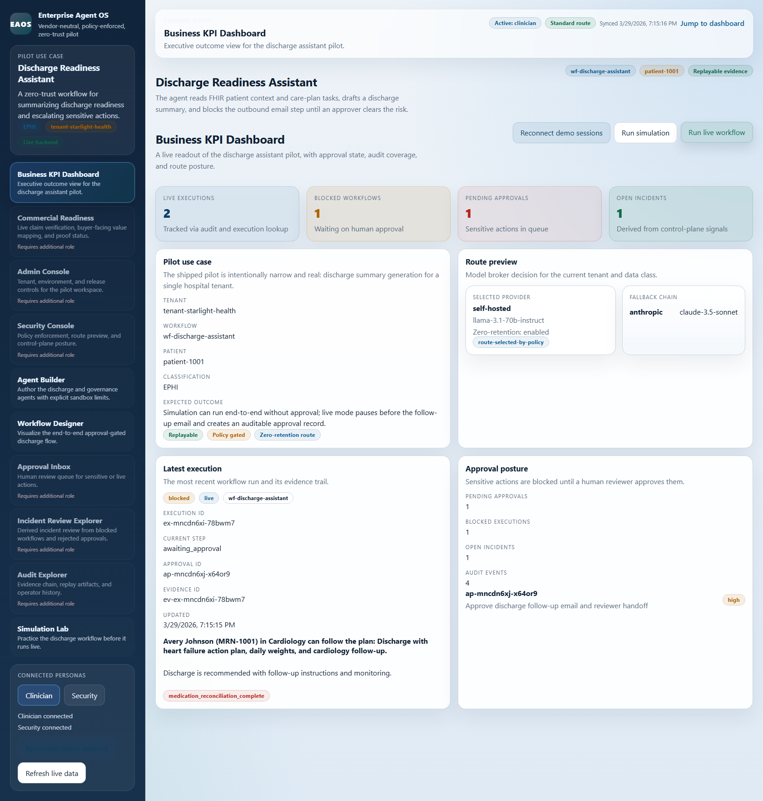
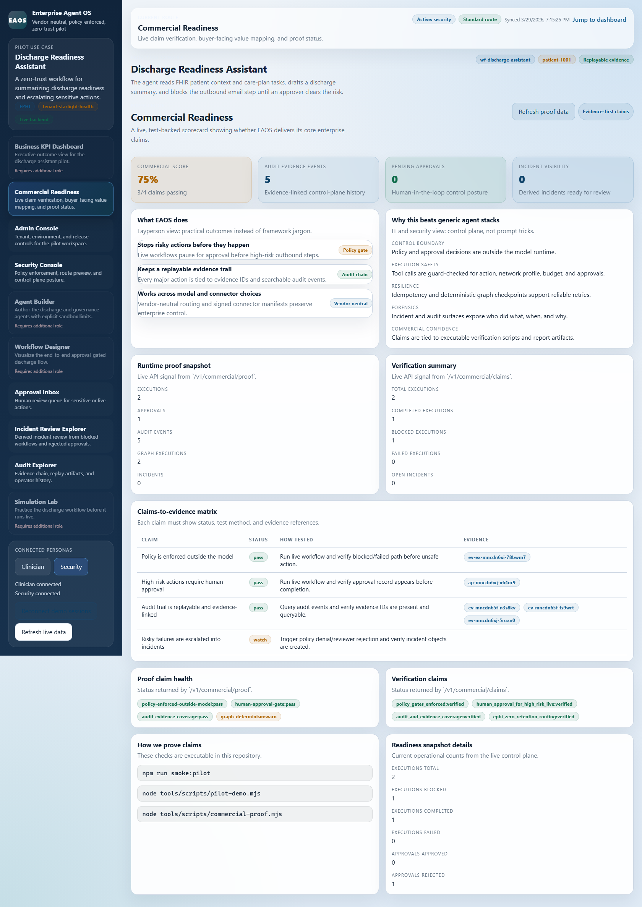
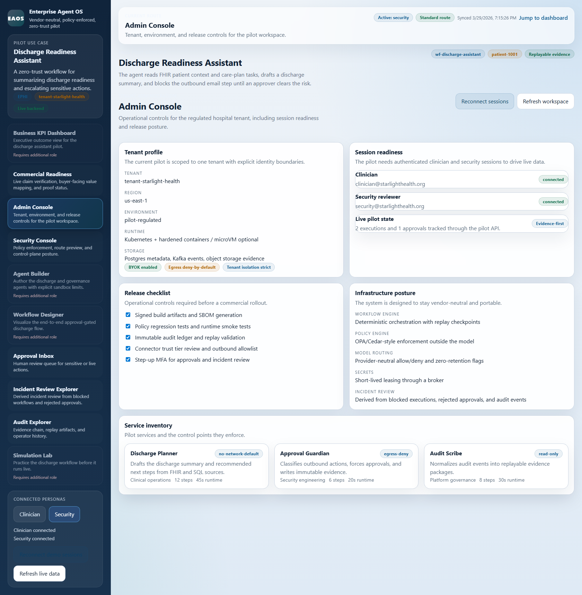
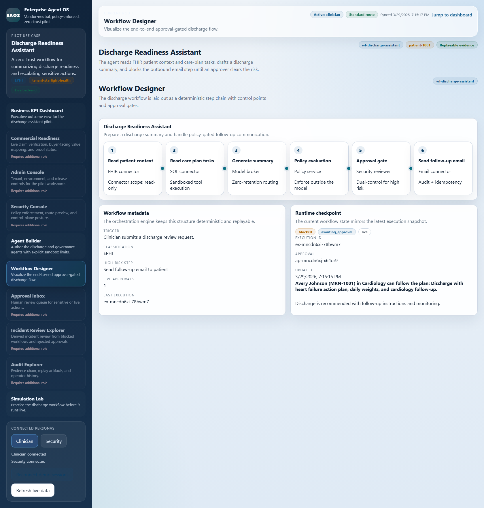
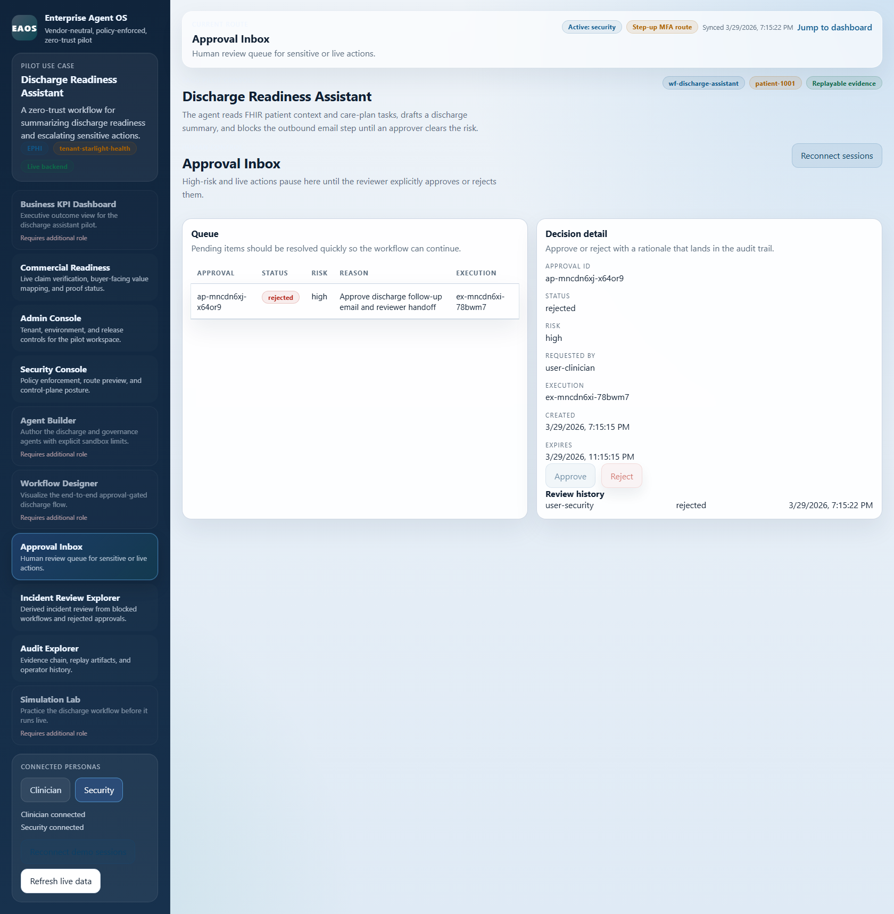
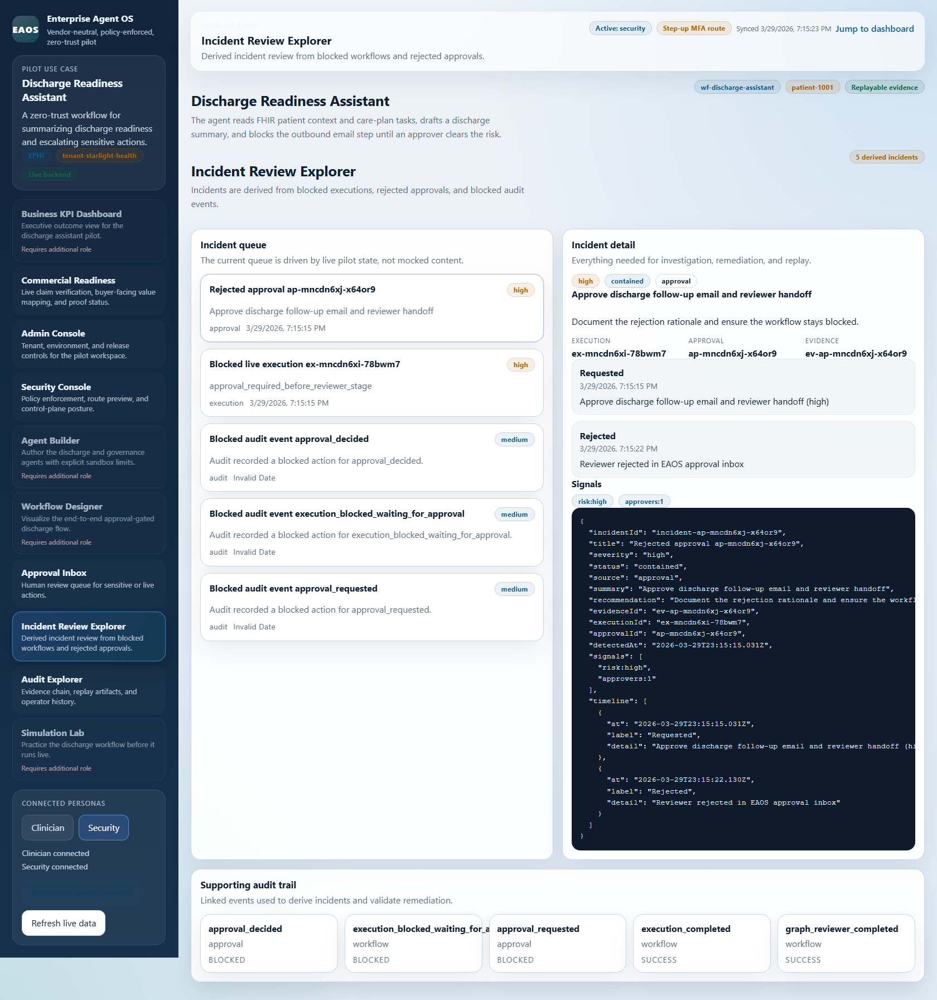
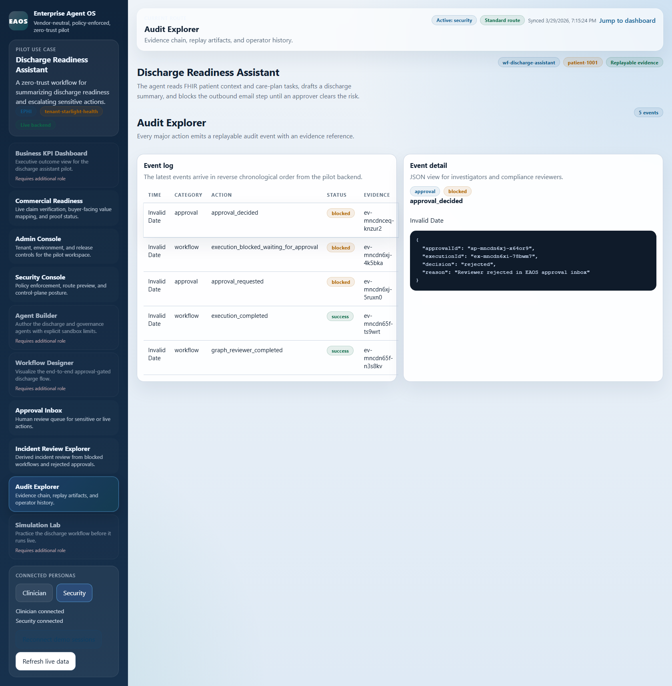
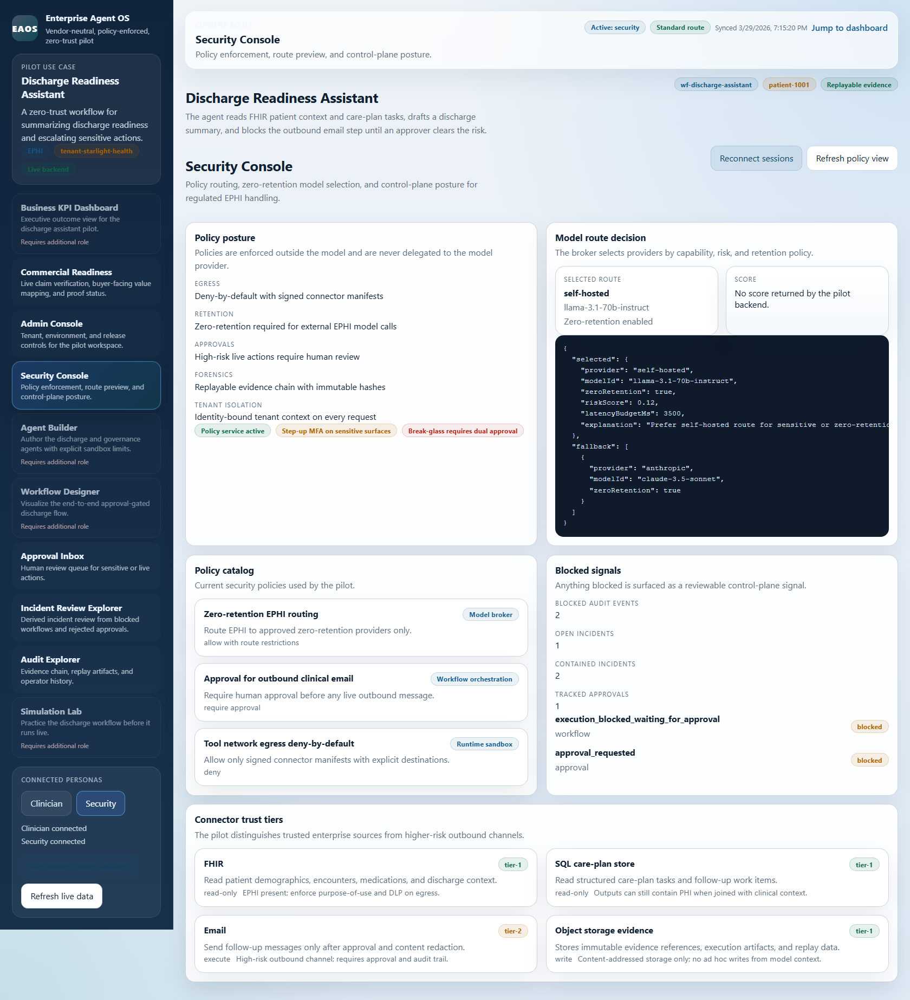
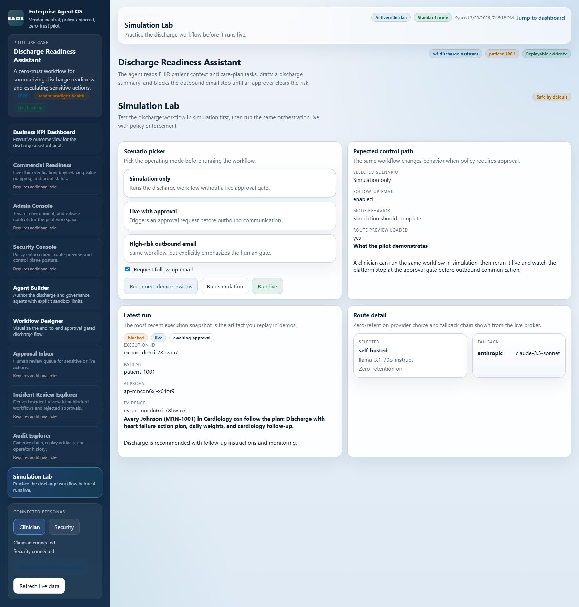

# EAOS: Enterprise Agent Orchestration and Trust Platform

EAOS is an open-source, vendor-neutral platform for running AI agents inside regulated enterprises with zero-trust controls, approval gates, and immutable evidence.

## Why EAOS

EAOS is built for healthcare and other high-regulation environments where data leakage is unacceptable.

- Vendor-agnostic model routing across OpenAI, Anthropic, Google, Azure, and self-hosted models
- Policy and approvals enforced **outside** the model
- Per-action audit evidence with replay-ready event history
- Multi-tenant isolation and deny-by-default runtime controls
- Simulation mode before live execution
- Signed connector registry with reference manifests (FHIR, HL7, SQL, Fabric, Power BI, SharePoint, Email, Ticketing, Linear)

## Pilot Use Case (Live Today)

The included pilot demonstrates a **Hospital Discharge Readiness Assistant**:

1. Reads patient context from FHIR + SQL connectors
2. Routes model inference based on sensitivity policy
3. Blocks high-risk outbound follow-up actions pending human approval
4. Captures immutable audit/evidence for every major action

## Screenshots

All screenshots below are captured from live route-specific pages in the running pilot app after seeding real workflow state.

### KPI Dashboard


### Commercial Readiness


### Admin Console


### Workflow Designer


### Approval Inbox


### Incident Review Explorer


### Audit Explorer


### Security Console


### Simulation Lab


## Quick Start

```bash
npm install
npm run typecheck
npm run test
npm run build
npm run smoke:pilot
```

Run the full pilot demo report:

```bash
node tools/scripts/pilot-demo.mjs
```

Regenerate commercial screenshots:

```bash
npm run screenshots:commercial
```

### Connector Control APIs (Pilot)

- `tool-registry`: `GET /v1/tools`, `POST /v1/tools`, `POST /v1/tools/{id}/publish`
- `tool-execution-service`: `POST /v1/tool-calls`, `GET /v1/tool-calls`, `GET /v1/tool-calls/{toolCallId}`

The demo output is saved to:

- `docs/assets/demo/pilot-demo-output.json`

## Architecture

The full architecture and threat model are documented in:

- `docs/eaos-blueprint.md`

## Documentation Map

- `docs/pilot/PILOT-RUNBOOK.md`
- `docs/tests/SMOKE-AND-PILOT-TEST-REPORT.md`
- `docs/manual/EAOS-OPERATOR-MANUAL.md`
- `docs/manual/EAOS-TRAINING-MANUAL.md`
- `docs/manual/EAOS-FAQ.md`
- `docs/manual/EAOS-SETUP-SUPPORT-GUIDE.md`
- `docs/i18n/` multilingual document packs (top 20 language coverage)

## Current Build Status

Validated in this repository:

- `npm run typecheck` passes
- `npm run test` passes
- `npm run build` passes
- `npm run smoke:pilot` passes
- Pilot end-to-end demo run saved with evidence output

## Contributing

EAOS is early and evolving. Contributions are welcome for:

- additional enterprise connectors
- hardened runtime isolation
- policy packs for regulated workflows
- observability and replay tooling
- localization quality improvements
