# EAOS Blueprint

## 1. Executive Summary

EAOS is a vendor-neutral enterprise agent orchestration and trust platform for regulated organizations, starting with hospitals and health systems. The MVP is designed to make every agent action policy-governed, approval-aware, auditable, and replayable.

### Platform position

- Control objective: Run AI agents in zero-trust enterprise environments without uncontrolled data leakage.
- Security objective: Treat PHI/ePHI exposure as a system failure, not a user error.
- Operating objective: Support cloud, private VPC, and on-prem with the same control model.
- Vendor objective: Keep model-provider specifics behind adapters so core business logic never depends on a single vendor.

### Opinionated defaults

- Default deny on data movement, network egress, and memory persistence.
- No high-risk action without policy decision and approval evidence.
- No external model invocation for sensitive classes unless policy explicitly allows and provider capability flags satisfy constraints.
- Every execution step produces immutable evidence envelopes.

## 2. Architecture Diagram (Mermaid)

```mermaid
graph TD
    subgraph XP[Experience Plane]
      UI1[Admin Console]
      UI2[Security Console]
      UI3[Agent Builder]
      UI4[Workflow Designer]
      UI5[Approval Inbox]
      UI6[Incident Review Explorer]
      UI7[Audit Explorer]
      UI8[Business KPI Dashboard]
      UI9[Simulation Lab]
    end

    subgraph CP[Control Plane]
      GW[API Gateway]
      AUTH[Auth Service]
      TEN[Tenant Service]
      POL[Policy Service]
      ORCH[Workflow Orchestrator]
      AGR[Agent Registry]
      TGR[Tool Registry]
      MB[Model Broker]
      CRS[Context Retrieval Service]
      CLS[Classification Service]
      APR[Approval Service]
      AUD[Audit Ledger]
      NOTIF[Notification Service]
      OBS[Observability Service]
      KS[Kill Switch Service]
      SB[Secrets Broker]
    end

    subgraph SAR[Secure Agent Runtime]
      RT[Runtime Supervisor]
      SBOX[Per-Agent Sandbox]
      TEXEC[Tool Execution Worker]
      MWR[Memory Write Guard]
      BUD[Budget/Step Guard]
      CHK[Deterministic Checkpoint Store]
      TVAL[Tool Result Validator]
    end

    subgraph DP[Data Plane]
      CONN[Enterprise Connectors]
      PG[(Postgres)]
      BUS[(Kafka or NATS)]
      REDIS[(Redis Ephemeral)]
      OBJ[(Object Storage)]
      IDX[(Vector/Index Store Optional)]
    end

    subgraph TP[Trust Plane]
      IDP[Enterprise IdP SAML/OIDC]
      KMS[BYOK/KMS]
      DLP[DLP + PHI/PII Scanner]
      PA[Policy + Approval Authority]
      IMM[Immutable Evidence Chain]
      EG[Egress Policy Controller]
      IR[Incident Forensics + Replay]
    end

    UI1 --> GW
    UI2 --> GW
    UI3 --> GW
    UI4 --> GW
    UI5 --> GW
    UI6 --> GW
    UI7 --> GW
    UI8 --> GW
    UI9 --> GW

    GW --> AUTH
    GW --> TEN
    GW --> POL
    GW --> ORCH
    GW --> APR
    GW --> AUD
    GW --> MB
    GW --> CRS
    GW --> CLS
    GW --> KS

    AUTH --> IDP
    POL --> PA
    APR --> PA
    SB --> KMS
    CLS --> DLP
    AUD --> IMM
    OBS --> IR
    KS --> ORCH

    ORCH --> BUS
    ORCH --> RT
    RT --> SBOX
    SBOX --> TEXEC
    SBOX --> MWR
    SBOX --> BUD
    SBOX --> CHK
    TEXEC --> TVAL
    TEXEC --> CONN

    TEN --> PG
    POL --> PG
    AGR --> PG
    TGR --> PG
    APR --> PG
    AUD --> PG
    AUD --> OBJ
    OBS --> OBJ
    ORCH --> REDIS
    ORCH --> PG
    BUS --> OBS

    MB --> SB
    TEXEC --> SB
    CRS --> IDX
    CRS --> PG
    CLS --> PG
    EG --> TEXEC
```



## 3. Detailed Architecture Spec

### 3.1 Control Plane

Responsibilities:
- Authenticate and authorize every request with tenant context.
- Evaluate policy and approval obligations before execution.
- Orchestrate deterministic workflows with checkpoint/replay.
- Manage agent/tool/model metadata and lifecycle.
- Emit signed evidence envelopes for every major action.

Services/components:
- API Gateway, Auth Service, Tenant Service, Policy Service, Workflow Orchestrator, Agent Registry, Tool Registry, Model Broker, Context Retrieval Service, Classification Service, Approval Service, Audit Ledger, Notification Service, Secrets Broker, Observability Service, Kill Switch Service.

APIs:
- External northbound REST (`/v1/*`) with signed JWT + tenant header.
- Internal east-west gRPC with mTLS SPIFFE identities.
- Event contracts on `eaos.control.*` topics/subjects.

Data flows:
- Request enters API Gateway.
- Auth verifies token and tenant binding.
- Policy Service evaluates action and returns `ALLOW`, `DENY`, or `REQUIRE_APPROVAL`.
- Workflow Orchestrator executes only after policy and approval prerequisites pass.
- Audit Ledger commits append-only evidence with hash chaining.

Trust boundaries:
- Boundary A: External client to gateway.
- Boundary B: Control plane to runtime.
- Boundary C: Control plane to model providers/connectors.
- Boundary D: Tenant partition boundaries.

Failure modes:
- Policy engine unavailable: fail closed, block action.
- Approval service latency: action remains pending, no implicit timeout approval.
- Event bus partition: orchestrator pauses progression, checkpoints durable state.
- Audit ledger write failure: action marked failed; no silent execution without evidence.

Scaling considerations:
- Stateless services horizontally scale on Kubernetes.
- Postgres partitioned by tenant and time for audit/event metadata.
- Event bus topics partitioned by tenant and workflow execution.
- Read-heavy consoles backed by materialized views.

### 3.2 Secure Agent Runtime

Responsibilities:
- Execute each agent step in strict isolation.
- Enforce budgets, tool allowlists, and network egress policy.
- Validate tool outputs before downstream use.
- Create deterministic checkpoints for replay and incident forensics.

Services/components:
- Runtime Supervisor, per-agent sandbox (microVM preferred; hardened container fallback), Tool Execution Worker, Memory Write Guard, Budget/Step Guard, Checkpoint Store, Tool Result Validator.

APIs:
- `POST /v1/runtime/executions` to start execution.
- `POST /v1/runtime/executions/{id}/steps/{n}` to advance deterministic step.
- `POST /v1/runtime/tool-call` policy-gated tool invocation.

Data flows:
- Orchestrator sends signed execution envelope to runtime.
- Runtime opens isolated sandbox with no default egress.
- Tool call request is signed, policy-checked, and executed via worker.
- Result is schema-validated and classified.
- Checkpoint + evidence written after each step.

Trust boundaries:
- Sandbox boundary between untrusted model/tool output and trusted control plane.
- Egress boundary with deny-by-default firewall.

Failure modes:
- Sandbox compromise signal: kill sandbox, quarantine artifacts, raise incident.
- Tool timeout: bounded retry with idempotency token.
- Budget exceeded: execution terminated with `blocked_budget_exceeded` disposition.

Scaling considerations:
- Runtime pools per tenant security tier.
- Autoscale on queued executions and CPU saturation.
- Use warm pools for latency-sensitive orchestrations.

### 3.3 Data Plane

Responsibilities:
- Persist metadata, evidence, logs, artifacts, and retrieval indices.
- Enforce classification-aware storage and retrieval controls.
- Isolate tenant data paths and encryption keys.

Services/components:
- Postgres, Kafka/NATS, Redis (ephemeral coordination only), object storage, optional vector index, connector gateway.

APIs:
- Internal data APIs behind service-specific ACLs.
- No direct tenant access to base stores.

Data flows:
- All writes include classification labels and provenance metadata.
- Evidence payloads stored in object storage with hash references in Postgres.
- Redis holds only non-sensitive ephemeral coordination tokens.

Trust boundaries:
- Separate storage accounts/buckets per tenant class or region.
- KMS key isolation per tenant and environment.

Failure modes:
- Storage outage: queue writes in bus with backpressure; fail closed for sensitive actions.
- Replica lag: readers use bounded-staleness with explicit indicators.

Scaling considerations:
- Time/tenant partitioning for audit tables.
- Tiered object lifecycle and retention.
- Optional dedicated data plane per large enterprise tenant.

### 3.4 Trust Plane

Responsibilities:
- Centralize trust decisions: auth, policy, approvals, data controls, evidence integrity.
- Ensure model and connector routing respects policy and sensitivity.

Services/components:
- Enterprise IdP integration, RBAC/ABAC engine, OPA/Cedar policy runtime, secrets broker, BYOK/KMS integration, DLP scanners, immutable ledger chain, break-glass controller.

APIs:
- `POST /v1/policy/evaluate`
- `POST /v1/approvals`
- `POST /v1/secrets/lease`
- `POST /v1/break-glass/request`

Data flows:
- Every request produces a policy decision artifact.
- High-risk actions create approval tickets with dual-control requirements.
- Secrets issued as short-lived leases scoped to single execution.

Trust boundaries:
- Trust plane is separate from runtime and from UX plane.
- No model can self-authorize.

Failure modes:
- KMS outage: block secret leasing and sensitive execution.
- DLP service degraded: route to high-sensitivity deny path.
- Break-glass abuse signal: automatic incident and temporary lockout.

Scaling considerations:
- Horizontal policy decision points with warmed policy bundles.
- Local in-region policy caches with signed bundle verification.

### 3.5 Experience Plane

Responsibilities:
- Give operators secure control over configuration, approvals, incident response, and evidence review.
- Provide role-aware UI with explicit policy/evidence visibility.

Services/components:
- Admin Console, Security Console, Agent Builder, Workflow Designer, Approval Inbox, Incident Review Explorer, Audit Explorer, Business KPI Dashboard, Simulation Lab.

APIs:
- All UX APIs are read/write through gateway.
- Real-time updates via SSE/WebSocket for approvals/incidents.

Data flows:
- Each UI action includes tenant, actor, and purpose context.
- UI renders policy decisions and evidence links inline.

Trust boundaries:
- Browser is untrusted; server-side authorization mandatory.
- Never trust client-side role checks as source of truth.

Failure modes:
- UI partial outage: backend remains operable via APIs.
- Session risk event: force re-authentication and step-up MFA.

Scaling considerations:
- CDN for static assets.
- Edge auth termination with strict headers and CSP.

### 3.6 Security Architecture (Hospital-grade)

Core controls:
- SSO with enterprise IdP (OIDC/SAML), SCIM provisioning, enforced MFA.
- RBAC + ABAC with purpose-of-use and data classification attributes.
- Multi-tenant isolation at identity, compute, network, data, and key layers.
- TLS 1.3 in transit, envelope encryption at rest, per-tenant BYOK/KMS keys.
- Secrets broker issues short-lived credentials only.
- Outbound egress deny-by-default with explicit allowlist per tool/connector.
- Sandboxed tool execution in microVM/hardened container with seccomp/AppArmor.
- PHI/PII/DLP scan on ingress and egress.
- Approval workflows for risky actions, dual approval for critical actions.
- Immutable audit logs with hash chain + signed envelopes.
- Break-glass access requires dual approval + automatic after-action review.
- Zero-retention mode enforcement for approved model providers.
- Policy-controlled model routing with provider capability assertions.
- Incident forensics and replay using deterministic checkpoints.

Security assumptions:
- Kubernetes cluster baseline hardening is enforced.
- Service identities are mTLS-bound and non-spoofable.
- KMS root of trust is managed by enterprise security.
- Connectors are deployed from signed artifacts only.

Compensating controls:
- If microVM unavailable, use hardened containers + stronger syscall and egress controls.
- If real-time DLP classifier unavailable, block sensitive paths and require manual review.
- If external model zero-retention cannot be attested, route to approved self-hosted model or deny.

Security test strategy:
- Policy tests: allow/deny regression corpus for every policy bundle change.
- Contract tests: verify every service emits required evidence envelope fields.
- Red-team scenarios: prompt injection, tool confusion, connector abuse, tenant breakout.
- Runtime chaos: kill policy service, bus partitions, KMS latency spikes.
- Container escape tests, egress bypass tests, and break-glass abuse simulations.

### 3.7 Agent Execution Model

Execution invariants:
- Every agent execution runs in a dedicated sandbox.
- Network access is `none` by default.
- Tools require signed manifests and explicit scopes.
- Step budget, token budget, and wall-clock budget are mandatory.
- Checkpoint state is deterministic and replayable.

Execution lifecycle:
- Intake: orchestrator validates command, policy decision, and approval status.
- Plan: runtime compiles step graph and assigns per-step limits.
- Execute: each step runs with explicit tool/model permissions only.
- Validate: tool and model outputs pass schema + classification + policy checks.
- Commit: checkpoint + evidence envelope persisted.
- Complete/Block: disposition finalized with reason codes.

Retries and rollbacks:
- Retries are bounded and idempotent by step key.
- Side-effecting tool calls require idempotency keys and compensating actions.
- Rollback plans are defined in workflow spec for write actions.

Human escalation:
- Automatic escalation triggers on repeated policy conflicts, high-risk write paths, or ambiguous classifications.
- Escalated workflows freeze runtime until approval decision.

Multi-agent patterns:
- Single-agent flow: direct execution with strict budgets.
- Orchestrator-worker: planner delegates constrained tasks to workers with no privilege inheritance by default.
- Planner-executor-reviewer: reviewer agent has no write privileges; can only recommend or block.
- Simulation-first mode: all multi-agent workflows must pass simulation baseline before live enablement.

Shared context constraints:
- Context is shared by explicit contract, never implicit memory leakage.
- Cross-agent context includes source/provenance labels and classification tags.
- Agents cannot read personal memory unless policy grants purpose-specific access.

### 3.8 Model Abstraction Layer

Provider adapters supported:
- OpenAI
- Anthropic
- Google
- Azure-hosted models
- Self-hosted open-weight models (for example vLLM/TGI endpoints)

Broker capabilities:
- Capability discovery API (`json_schema`, `tool_use`, `vision`, `streaming`, `zero_retention`).
- Model allow/deny policy by tenant, data class, and purpose.
- Sensitivity-aware routing with hard policy guardrails.
- Fallback routing sequence with deterministic selection and reason codes.
- Cost/performance/risk scoring model with pluggable weights.
- Prompt/output trace metadata (hash refs, token counts, latency, route decision).
- Adapter normalization so provider-specific fields never leak into core domain services.

Default routing policy:
- EPHI: self-hosted preferred; external only when policy exception + zero-retention attestation + approval.
- PHI/PII: approved providers with zero-retention support and strict redaction obligations.
- PUBLIC/INTERNAL: cost-optimized route within tenant policy allowlist.

### 3.9 Tooling and Integration Framework

Tool framework requirements:
- Connector manifest with signed digest and version pinning.
- Permission scopes for read/write/execute separated at action level.
- Runtime scope enforcement with policy check before every tool call.
- Test harness for connector conformance and abuse cases.
- Mock mode for simulation with deterministic responses.
- Audit metadata on each call: actor, tenant, policy decision, approval IDs, input/output refs.
- Rate limits per tool and per tenant.
- Idempotency protection for side-effecting writes.

Reference connector set:
- Microsoft Fabric
- Power BI
- SQL databases (read-first and approved write patterns)
- FHIR APIs
- HL7 interfaces
- SharePoint
- Email
- Ticketing systems
- Project systems (Linear)

Connector trust behavior:
- Tier-based enforcement determines sandbox strength, allowed operations, and approval thresholds.
- New connector versions require signature verification and staged rollout.

### 3.10 Compliance and Evidence Layer

Evidence model (required fields):
- Who initiated an action (`actorId`, role, assurance level).
- Which data sources were touched (connector IDs + object refs).
- Which policies were evaluated (bundle/version/rule IDs).
- What model was used (provider adapter, model ID, route reason).
- What tools were called (manifest version, scope, result status).
- What approvals were granted (approvers, timestamps, rationale).
- What output classification was assigned.
- Whether anything was blocked and why.
- Final disposition.

Evidence package types:
- Security review package: policy paths, risk decisions, egress events, anomaly traces.
- Compliance review package: immutable event chain, approvals, retention/deletion attestations.
- Incident response package: timeline, replay bundle, impacted assets, containment actions.
- Executive reporting package: KPI summaries, risk trends, SLA/SLO posture, control coverage.

Forensics and replay:
- Replay engine reconstructs execution from checkpoints and event log with deterministic ordering.
- Chain-of-custody metadata is included in exported bundles.

## 4. Threat Model

### 4.1 Threat model scope

Assets:
- PHI/ePHI, PII, secrets, policy bundles, audit evidence, model prompts/outputs.

Threat actors:
- External attackers, malicious insiders, compromised credentials, compromised connector vendors, rogue model provider endpoints.

### 4.2 Attack surfaces

- Northbound APIs and web consoles.
- Agent runtime and tool sandbox boundary.
- Connector integrations and outbound network paths.
- Model provider APIs and adapter implementations.
- Secrets distribution and key management paths.
- CI/CD and software supply chain.

### 4.3 STRIDE summary

- Spoofing: stolen tokens, service impersonation.
- Tampering: policy bundle manipulation, evidence log edits.
- Repudiation: denial of high-risk approvals.
- Information disclosure: cross-tenant leakage, prompt leakage, tool output exfiltration.
- Denial of service: execution flood, bus saturation, approval queue exhaustion.
- Elevation of privilege: role escalation, sandbox escape, break-glass abuse.

### 4.4 Controls by attack class

- Identity spoofing: MFA, short-lived JWT, device posture checks, mTLS SPIFFE.
- Policy tampering: signed policies, immutable policy versions, dual control for production policy publish.
- Audit repudiation: append-only ledger with hash chain, signed evidence packages.
- Data leakage: ingress/egress DLP scan, allowlisted destinations, output redaction, zero-retention enforcement.
- Runtime abuse: per-execution budgets, step limits, circuit breakers, kill switch.
- Privilege escalation: least privilege IAM, ABAC purpose checks, just-in-time elevation with expiry.

### 4.5 Explicit security assumptions

- Enterprise IdP is authoritative for identities.
- KMS/HSM trust anchor is uncompromised.
- Operator break-glass process includes independent approvers.
- Production secrets are never stored in source control.

### 4.6 Residual risk and treatment

- New model-provider behavior drift: mitigate with canary routing + policy constraints + continuous capability attestations.
- Prompt injection via trusted data source: mitigate with retrieval provenance checks and content sanitization.
- Third-party connector compromise: mitigate with trust tiers, scoped tokens, and connector kill switch.

## 5. Backend Service Map

### 5.1 Service overview matrix

| Service | Purpose | Storage | Security Requirements |
|---|---|---|---|
| API Gateway | Unified API ingress and policy pre-flight | Redis (rate limit), Postgres (config) | mTLS upstream, JWT verification, tenant binding |
| Auth Service | IdP federation, token/session assurance | Postgres | MFA, step-up auth, token rotation |
| Tenant Service | Tenant lifecycle and isolation policy | Postgres | strict tenant boundary checks |
| Policy Service | OPA/Cedar policy evaluation | Postgres, policy bundle store | signed policies, fail closed |
| Workflow Orchestrator | Event-driven workflow state machine | Postgres, Kafka/NATS, Redis | deterministic checkpoints, idempotency |
| Agent Registry | Agent metadata and versions | Postgres, object storage | signed manifests, provenance |
| Tool Registry | Tool manifest and permissions | Postgres | signed definitions, scope validation |
| Tool Execution Service | Isolated tool invocation | object storage, Kafka/NATS | sandboxing, no default egress |
| Model Broker | Provider-neutral model dispatch | Postgres, Redis | sensitivity-aware routing, zero-retention check |
| Context Retrieval Service | Policy-safe retrieval context assembly | Postgres, optional vector store | purpose checks, row-level tenant filtering |
| Classification Service | PHI/PII/DLP classification/redaction | Postgres | deterministic redaction and confidence thresholds |
| Approval Service | Human approvals and dual-control | Postgres, Kafka/NATS | quorum enforcement, anti-replay |
| Audit Ledger | Immutable evidence and replay index | Postgres, object storage | hash chain integrity, tamper alerts |
| Notification Service | Approval/incident notifications | Kafka/NATS | signed notification events |
| Secrets Broker | Short-lived credential leasing | Postgres, KMS | least privilege leases, TTL enforcement |
| Observability Service | OTel traces, logs, metrics and SLOs | object storage, metrics backend | sensitive field scrubbing |
| Kill Switch Service | Scoped/global execution halt | Redis, Postgres | dual-approval for global kill |

### 5.2 API contracts per service (representative)

API Gateway:
- `POST /v1/workflows/{id}/execute`
- `POST /v1/agents/{id}/simulate`

Auth Service:
- `POST /v1/auth/login`
- `POST /v1/auth/token/refresh`
- `POST /v1/auth/step-up`

Policy Service:
- `POST /v1/policy/evaluate`
- `POST /v1/policy/bundles/{bundleId}/publish`

Workflow Orchestrator:
- `POST /v1/executions`
- `GET /v1/executions/{executionId}`
- `POST /v1/executions/{executionId}/cancel`

Model Broker:
- `POST /v1/model/infer`
- `GET /v1/model/providers`
- `POST /v1/model/route/preview`

Tool Execution Service:
- `POST /v1/tools/{toolId}/execute`
- `POST /v1/tools/{toolId}/simulate`

Approval Service:
- `POST /v1/approvals`
- `POST /v1/approvals/{approvalId}/decide`

Audit Ledger:
- `POST /v1/audit/events`
- `GET /v1/audit/evidence/{evidenceId}`
- `POST /v1/audit/replay/{executionId}`

Secrets Broker:
- `POST /v1/secrets/lease`
- `POST /v1/secrets/revoke/{leaseId}`

Kill Switch:
- `POST /v1/kill-switch/activate`
- `POST /v1/kill-switch/release`

### 5.3 Main entities

- Tenant, User, Role, AttributeSet, PolicyBundle, PolicyDecision, ApprovalTicket, AgentDefinition, ToolManifest, WorkflowDefinition, Execution, StepCheckpoint, ModelRouteDecision, ConnectorCredentialLease, AuditEvent, EvidenceEnvelope, IncidentCase.

### 5.4 Example strongly-typed interfaces

```ts
export interface ExecuteWorkflowCommand {
  workflowId: string;
  tenantId: string;
  actorId: string;
  mode: "simulation" | "live";
  inputRef: string;
  requestedRiskLevel: "low" | "medium" | "high" | "critical";
}

export interface ExecuteWorkflowResult {
  executionId: string;
  status: "queued" | "running" | "blocked";
  policyDecisionId: string;
  approvalId?: string;
}
```

```go
type ModelRouteRequest struct {
    TenantID              string
    Sensitivity           string
    RequiredCapabilities  []string
    ZeroRetentionRequired bool
    MaxLatencyMs          int
}

type ModelRouteDecision struct {
    ProviderAdapter string
    ModelID         string
    Score           float64
    ReasonCodes     []string
}
```

## 6. Front-end App Structure

Architecture:
- React + TypeScript SPA with route-level role guards.
- Domain modules per console area.
- Query/mutation layer with typed API client and strict error envelopes.

Routing structure:
- `/admin`
- `/security`
- `/agents`
- `/workflows`
- `/approvals`
- `/incidents`
- `/audit`
- `/dashboard`
- `/simulation`

Component architecture:
- `app/` shell, providers, auth bootstrap.
- `features/admin`, `features/security`, `features/agents`, `features/workflows`, `features/approvals`, `features/incidents`, `features/audit`, `features/dashboard`, `features/simulation`.
- `shared/ui` design system components.
- `shared/api` typed clients.

Auth guards:
- Route guard checks authenticated session + tenant binding.
- Capability guard checks role + ABAC claims from token and server-side policy preview.
- Step-up MFA guard for security and break-glass workflows.

State strategy:
- React Query for server state.
- Zustand for session/tenant UI state only.
- No sensitive payload persistence in browser local storage.

Design system:
- Tokenized design system with high-contrast accessibility defaults.
- Evidence and trace components first-class in all major workflow views.

Accessibility requirements:
- WCAG 2.2 AA target.
- Keyboard-only operation for approvals and incident review.
- Screen-reader labels for evidence timelines and policy decision cards.

Role-aware behavior:
- Hide unauthorized write controls.
- Always show why action is blocked (policy reason code), not just generic failure.

Evidence and trace views:
- Every workflow/execution page displays policy decisions, approvals, model routes, tool calls, and final disposition with clickable evidence IDs.

## 7. Data Governance Matrix

### 7.1 Classification schema

| Class | Description | Examples |
|---|---|---|
| PUBLIC | Non-sensitive | product docs |
| INTERNAL | Internal business data | runbooks |
| CONFIDENTIAL | Sensitive internal and contractual | pricing, HR data |
| PII | Personal identifiers | SSN, email, address |
| PHI | Protected health info | diagnosis, treatment |
| EPHI | Electronic PHI | EHR extracts, claims records |
| SECRET | Credentials and keys | API tokens, signing keys |

### 7.2 Policy matrix by class

| Data Class | External Model Allowed | Zero-Retention Required | Human Approval | Retention | Egress |
|---|---|---|---|---|---|
| PUBLIC | Yes | No | No | 2y | Allowlisted |
| INTERNAL | Yes (approved providers) | Optional by policy | No | 3y | Allowlisted |
| CONFIDENTIAL | Conditional | Usually yes | Medium-risk writes | 5y | Strict allowlist |
| PII | Conditional + redaction | Yes | High-risk actions | 7y | Strict allowlist |
| PHI | Conditional, policy exception only | Yes mandatory | High-risk actions | HIPAA-aligned 6y+ |
| EPHI | Default no external; exception only | Yes mandatory | Dual approval | HIPAA-aligned 6y+ |
| SECRET | Never to model | N/A | Dual approval | rotation + archive | No external |

### 7.3 Retrieval restrictions (role + purpose)

- Clinician: PHI/EPHI read for treatment purpose only.
- Revenue cycle analyst: minimum fields, no unrestricted chart access.
- Security analyst: masked payload by default, unmask requires approval and ticket link.
- Platform admin: no default data payload access, only metadata unless approved.

### 7.4 Output redaction rules

- Pattern and ML redaction for MRN, SSN, phone, email, account IDs, addresses, DOB.
- Contextual redaction for free-text notes with confidence threshold and human review queue.
- Model outputs are classified and redacted before leaving trust boundary.

### 7.5 Connector trust tiers

- Tier 1 (Enterprise trusted): managed identity + full audit + write allowed by policy.
- Tier 2 (Partner trusted): scoped tokens + enhanced validation + conditional write.
- Tier 3 (Restricted): read-only default + mandatory simulation before live.
- Tier 4 (Untrusted/public): simulation only unless explicit exception policy.

### 7.6 Memory policy

- Session memory: ephemeral, TTL <= 24h, never cross-user.
- Task memory: execution-scoped, deleted/archived per policy.
- Organizational memory: curated knowledge with provenance and review workflow.
- Personal memory: user-bound, export/delete controls, no automatic promotion to org memory.

Memory write controls:
- Durable write requires policy allow + provenance + classification + reason code.
- EPHI durable memory writes require explicit policy exception and dual approval.

### 7.7 Residency, retention, deletion

- Residency constraints are attached to tenant and enforced by routing/storage policy.
- Region-locked processing for regulated tenants.
- Retention schedules by class with legal hold override.
- Cryptographic erasure for deletion and auditable deletion events.

## 8. API Contract Examples

### 8.1 Policy evaluation

```http
POST /v1/policy/evaluate
```

```json
{
  "tenantId": "tenant-hospital-a",
  "actor": {
    "actorId": "u-123",
    "roles": ["clinician"],
    "assuranceLevel": "aal2"
  },
  "action": "model.infer",
  "resource": {
    "type": "clinical-note",
    "classification": "EPHI"
  },
  "purpose": "care_delivery",
  "route": {
    "provider": "openai",
    "zeroRetention": true
  }
}
```

```json
{
  "decisionId": "pd-77",
  "effect": "REQUIRE_APPROVAL",
  "obligations": ["dual_approval", "redact_before_send"],
  "reasons": ["ephi_external_inference_requires_dual_control"],
  "ttlSeconds": 300
}
```

### 8.2 Workflow execution

```http
POST /v1/executions
```

```json
{
  "workflowId": "wf-discharge-assistant",
  "mode": "simulation",
  "inputRef": "obj://tenant-a/executions/e-100/input.json",
  "requestedRiskLevel": "high"
}
```

```json
{
  "executionId": "e-100",
  "status": "queued",
  "policyDecisionId": "pd-77",
  "approvalId": "ap-55"
}
```

### 8.3 Tool execution

```http
POST /v1/tools/fhir.read-patient/execute
```

```json
{
  "executionId": "e-100",
  "action": "READ",
  "idempotencyKey": "idemp-abc-001",
  "params": {
    "patientId": "12345"
  }
}
```

```json
{
  "toolCallId": "tc-912",
  "status": "completed",
  "resultRef": "obj://tenant-a/executions/e-100/tool/tc-912.json",
  "classification": "EPHI"
}
```

### 8.4 Model broker routing preview

```http
POST /v1/model/route/preview
```

```json
{
  "tenantId": "tenant-hospital-a",
  "sensitivity": "PHI",
  "requiredCapabilities": ["json_schema", "tool_use"],
  "zeroRetentionRequired": true,
  "maxLatencyMs": 4000
}
```

```json
{
  "selected": {
    "provider": "azure-openai",
    "model": "gpt-4.1-mini",
    "zeroRetention": true
  },
  "fallback": [
    {"provider": "anthropic", "model": "claude-sonnet", "zeroRetention": true},
    {"provider": "self-hosted", "model": "llama-3.1-70b", "zeroRetention": true}
  ],
  "score": {
    "cost": 0.71,
    "latency": 0.84,
    "risk": 0.93
  }
}
```

## 9. Monorepo File/Folder Structure

```text
eaos/
  .github/
    workflows/
      ci.yml
      cd.yml
  docs/
    eaos-blueprint.md
  backend/
    services/
      api-gateway/
      auth-service/
      tenant-service/
      policy-service/
      workflow-orchestrator/
      agent-registry/
      tool-registry/
      tool-execution-service/
      model-broker/
      context-retrieval-service/
      classification-service/
      approval-service/
      audit-ledger/
      notification-service/
      secrets-broker/
      observability-service/
      kill-switch-service/
    shared/
      contracts/
      events/
      policies/
        rego/
        cedar/
    runtime/
      python-agent-runner/
  frontend/
    apps/
      admin-console/
  infrastructure/
    kubernetes/
      base/
      overlays/
    helm/
      eaos/
    terraform/
      modules/
  tools/
    scripts/
  tests/
    contracts/
    security/
    e2e/
```

## 10. MVP Implementation Plan

### 10.1 MVP in-scope

- Secure control plane foundation.
- Policy service with OPA/Cedar support.
- Model broker with provider adapters and sensitivity-aware routing.
- Secure runtime supervisor and tool execution service.
- Approval workflow with dual-control for critical actions.
- Immutable audit/evidence pipeline.
- Two connectors: SQL (read-only + parameterized query) and FHIR (read-first profile).
- Admin console + simulation lab + KPI dashboard.

### 10.2 Deferred from MVP

- Full workflow visual editor with advanced branching UX.
- Broad connector catalog beyond SQL/FHIR.
- Advanced fine-grained billing and chargeback.
- Multi-region active-active control plane.
- Full autonomous multi-agent optimization loops.

### 10.3 Technical debt risks

- Early policy authoring UX may lag policy complexity.
- Runtime hardening parity between microVM and container fallback.
- Replay storage costs can grow quickly without retention controls.
- Adapter drift across model vendors requires ongoing contract tests.

### 10.4 30/60/90 day plan

30 days:
- Deliver auth, tenant, policy, workflow skeletons with signed event envelopes.
- Ship simulation-only execution path and audit ledger basics.
- Deploy local dev stack and CI gates.

60 days:
- Add live execution with approval workflow and kill switch.
- Implement model broker adapters (OpenAI, Anthropic, Google, Azure, self-hosted vLLM).
- Add SQL and FHIR connectors with trust-tier controls.

90 days:
- Harden runtime egress controls and incident replay tooling.
- Launch admin/security consoles, approval inbox, KPI dashboards.
- Complete security test suite and pilot readiness package.

### 10.5 CI/CD design

- CI on every PR: typecheck, unit tests, contract tests, security scan, policy tests.
- Protected main branch with required approvals and signed commits.
- Image build pipeline with SBOM generation and signature (cosign).
- Promotion pipeline: dev -> staging -> prod with manual security gate.

### 10.6 Testing strategy

- Unit tests: policy evaluators, model routing, connector adapters.
- Contract tests: all APIs + event schema compatibility.
- Security tests: egress deny tests, tenant isolation tests, secret lease TTL tests.
- Replay tests: deterministic checkpoint replay parity.
- Simulation/live differential tests before production rollout.

### 10.7 Local development setup

- `docker compose up -d postgres zookeeper kafka redis minio`
- `npm install`
- `npm run typecheck`
- `npm run test`
- Start selected services and frontend in watch mode.

### 10.8 Go/no-go entry criteria for pilot

- No critical unresolved security findings.
- Policy and approval coverage for all high-risk actions.
- Evidence completeness >= 99.9% for executed workflows.
- Successful disaster-recovery restore and replay drills.
